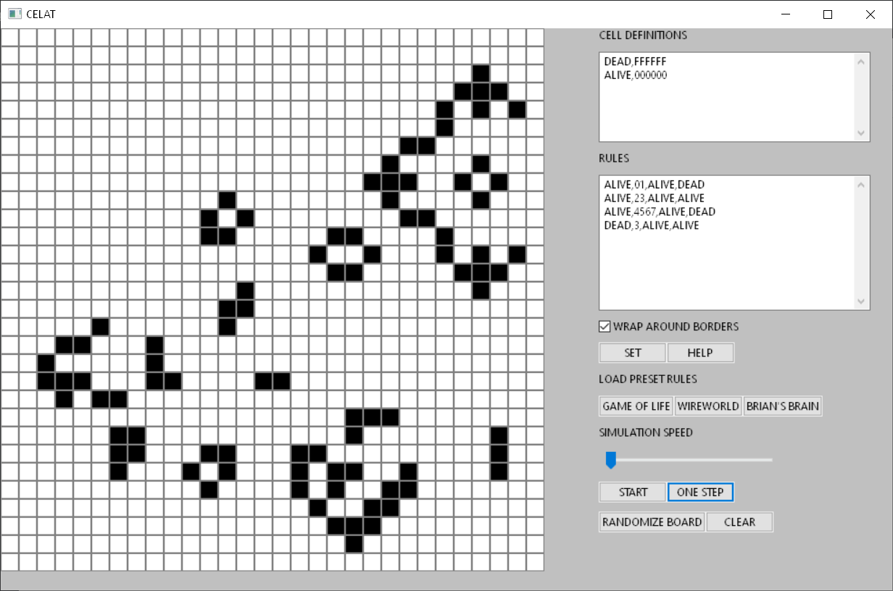
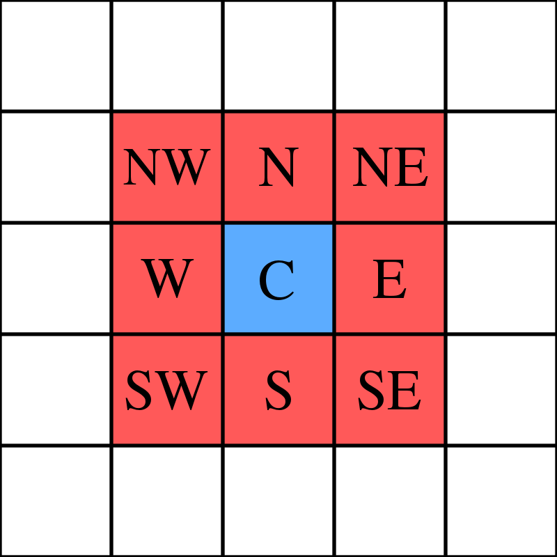

# CELAT - Universal Cellular Automaton

## Milan Abrahám

## Zadání

Cílem práce je vytvořit univerzální celulární automat, kterému lze specifikovat pravidla na změnu stavů. Program bude obsahovat uživatelské rozhraní. Pro demonstraci funkčnosti v něm bude naimplemetovány automaty Game of Life [[1]](#zdroje) a Wireworld [[2]](#zdroje).

## Úvod

Program napsaný v jazyce C++ obsahuje uživatelské rozhraní, jehož součástí je reprezentace automatu a ovládací prvky. Stavy (buňky) jsou reprezentovány v mřížce 30x30, buňky mají rozdílné barvy definované uživatelem. V ovládacím panelu uživatel upravuje chování automatu pomocí definice buňek, pravidel a dalších nastavení. 

Součástí projektu je uživatelská dokumentace obsahující návod k instalaci a sestavení, vysvětlení použití automatu a formátu pravidel. Aplikace obsahuje tři předefinované automaty a to Game of Life [[1]](#zdroje), Wireworld [[2]](#zdroje) a Brian's Brain [[3]](#zdroje).

Projekt jsem rozdělil na dvě hlavní části - knihovna implementující univerzální automat a uživatelské rozhraní používající tuto knihovnu.

**Ukázka rozhraní:**

## Pravidla

Nejdříve jsem si prošel běžné automaty a analyzoval jejich pravidla. Existuje velké množství automatů, každý ovládaný jinými pravidly. Některé automaty jsou velmi rozdílné a nebylo možné nalézt podobnost v jejich pravidlech. Ovšem velkou podmnožinu automatů lze definovat dvěma typy pravidel:

1. Pokuď buňka se stavem A má X sousedů se stavem B změn její stav na C.

2. Buňku se stavem A vždy přeměň na stav C.

Tyto dva typy pravidel proto automat umí zpracovat. Více informací o formátu pravidel obsahuje uživatelská dokumentace.

## Sousedství buňky a přetékaní hran

Většina automatů využívá Moorovo sousedství [[4]](#zdroje). To znamená, že buňka má právě 8 sousedů.

Aumatová mřížka by teoreticky měla být nekonečná, což samozřejmě není možné implementovat. Je proto potřeba mřížku omezit. To lze vyřešit dvěma způsoby. Lze nastavit pevný okraj a okrajové buňky necháme s méně sousedy, což ale může způsobit nekonzistentí chování pravidel. Druhou možností je nechat okraje přetékat, všechny buňky poté budou mít 8 sousedů. Aplikace umožnuje obě nastavení.

### Automat

Knihovna `automat.hpp` je navržena tak, aby byla nezávislá na zbytku aplikace a může tak být použita v jiných projektech.

Obsahuje hlavní třídu `Automat` a struktury `CellType` a `Rule` pro definice stavů a pravidel.

Poznámka: Automat v uživatelském rozhraní umožňuje jen pevnou velikost 30x30 buňek a to kvůli obtížnému nastavování variabilní velikosti uživatelského rozhraní. Knihovna ovšem umožňuje jakoukoliv výšku a šířku automatu.

#### Konstruktor

Definice stavů a pravidel jsou poskytnuty konstruktoru třídy `Automat`. Ten je zpracuje, zkontroluje formátování, převede do struktury `CellType` nebo `Rule` a uloží do příslušného vektoru. Konstruktor dále požaduje výšku a šířku mřížky automatu a boolean, indikující zda automat na hranách přetéká.

Pravidla mají formát, který je potřeba striktně dodržovat. Je popsán v uživatelské dokumentaci. Pokud je nalezena chyba je vyvolána výjimka ``Automat::InvalidFormatException`` obsahující chybovou zprávu. Pokud je tato výjimka vyvolána, objekt se nevytvoří a je potřeba zavolat konstruktor znovu se spravným formátem pravidel. 

Poté, co se zpracují pravidla, se inicializují všechny potřebné struktury. Tou hlavní je `std::vector<size_t> cells`, pole obsahující všechny buňky automatu. Buňky mají defaultní hodnotu, tou je první definovaný typ buňky. Pole obsahuje indexy typů ve vektoru `std::vector<CellType> cellTypes`. Používány jsou indexy místo pointerů pro rychlejší měnění stavů, mazání a randomizaci.  

#### Souřadnice

Buňky jsou sice interně ukládány do 1-rozměrného pole, ovšem rozhraní třídy poskytujíe přístup pomocí souřadnicového systému. Osa X je vertikální, Y horizontální. Nejlevější horní buňka má souřadnice 0, 0. Souřadnice se zvyšují dolů a doprava.  

#### Funkce automatu

Hlavní funkcí automatu je `void doOneEvolution()`, která všechny buňky posune vpřed o jednu evoluci. To znamená, že jsou na každou buňku aplikována pravidla automatu.

Dále obsahuje funkce pro obsluhu:

`std::string getColourAt(const size_t x, const size_t y) const` vrátí string obsahující barvu buňky v hexadecimálním formátu.

`void cellCycleType(const size_t x, const size_t y)` změní typ buňky na další v pořadí, céž je vhodné pro uživatelské rozhraní.

`void clearCells()` a `void randomizeCells()` změní typ buňek na defultní nebo náhodný.

## Uživatelské rozhraní

Knihovna použita pro uživatelské rozhraní se nazývá wxWidgets [[5]](#zdroje). Umožňuje vcelku přímočaré vytvoření prvků uživatelského rozhraní a následné propojení s událostmi.  Trochu složité je poté rozmístění prvků. Je realizováno pomocí tzv. sizerů. Sizer umožňuje rozmístění horizontálně nebo vertikálně. Proto jich bylo potřeba zkombinovat více k dosažení finálního výsledku.

Asi nejsložitější poté bylo vytvořit mřížku automatu, která by umožňovala rychlé překreslování a interakci s uživatelem. Nejdříve jsem vyzkoušel wxGrid, což je mřížka velice podobná například tabulce v Excelu. Ukázala se být nevhodná, protože buňky nešly zmenšit na požadovanou velikost.

Jako vhodné řešení se ukázal wxPanel (běžný panel sloužící k seskupení a ovládání prvků). Nad tím je potřeba sestrojit objekt wxPaintDC, který umožňuje kreslení na prvek, nad kterým je sestrojen. Poté je kreslení řešeno pomocí eventů. Zorbrazení mřížky je vcelku jednoduše realizováno kreslením čtverců příslušné barvy. Při kliknutí na mřížku se vypočtou souřadnice buňky a ty jsou předány automatu.

## Distribuce

Nejdříve jsem chtěl aplikaci sestavovat pomocí CMake a vyzkoušel jsem různé GUI knihovny (např SFML, Qt), ovšem nepodařilo se mi zprovoznit ani jednu. Rozhodl jsem se proto vyvíjet ve Visual Studiu 2019, kde se mi podařilo zprovoznit právě wxWidgets.

Projekt jsme se rozhodl distribuovat pomocí projektu pro Visual Studio (.sln). V uživatelské dokumentaci je návod na instalování a sestavení pomocí příkazové řádky.

Nevýhodou této knihovny je velikost po kompilaci. Dosahuje skoro 2GB a to jenom verze pro Windows (x64 a x86). V průběhu vývoje jsem musel změnit verzovací systém z GitHub na Gitlab, kvůli limitu velikosti souborů. Pro ušetření času stahování a nahrávání jsem musel přistoupit ke zkomprimování knihovny do archivu ZIP.

Přišlo mi to jako přijatelné řešení oproti nucení uživatele, aby si knihovnu stáhnul a zkompiloval sám.

## Závěr

Podařilo se mi vytvořit funkční univerzální celulární automat a implementovat v něm 3 různé automaty. I přes značné počáteční problémy s knihovnami pro uživatelské rozhraní jsem s výsledkem spokojen. Podle mého názoru jsou však jiné jazyky jako například C# nebo Java vhodnější pro vytváření uživatelského rozhraní. Znovu bych už C++ pro GUI nepoužil. Přesto se mi podařilo obohatit mé znalosti jazyka.

## Zdroje

[1] [Conway's Game of Life - Wikipedia](https://en.wikipedia.org/wiki/Conway%27s_Game_of_Life)

[2] [Wireworld - Wikipedia](https://en.wikipedia.org/wiki/Wireworld)

[3] [Brian's Brain - Wikipedia](https://en.wikipedia.org/wiki/Brian%27s_Brain)

[4] [Moorovo okolí – Wikipedie](https://cs.wikipedia.org/wiki/Moorovo_okol%C3%AD)

[5] [wxWidgets](https://wxwidgets.org/)

## Obrázky

[Moorovo okolí](https://cs.wikipedia.org/wiki/Moorovo_okol%C3%AD#/media/Soubor:Moore_neighborhood_with_cardinal_directions.svg)
