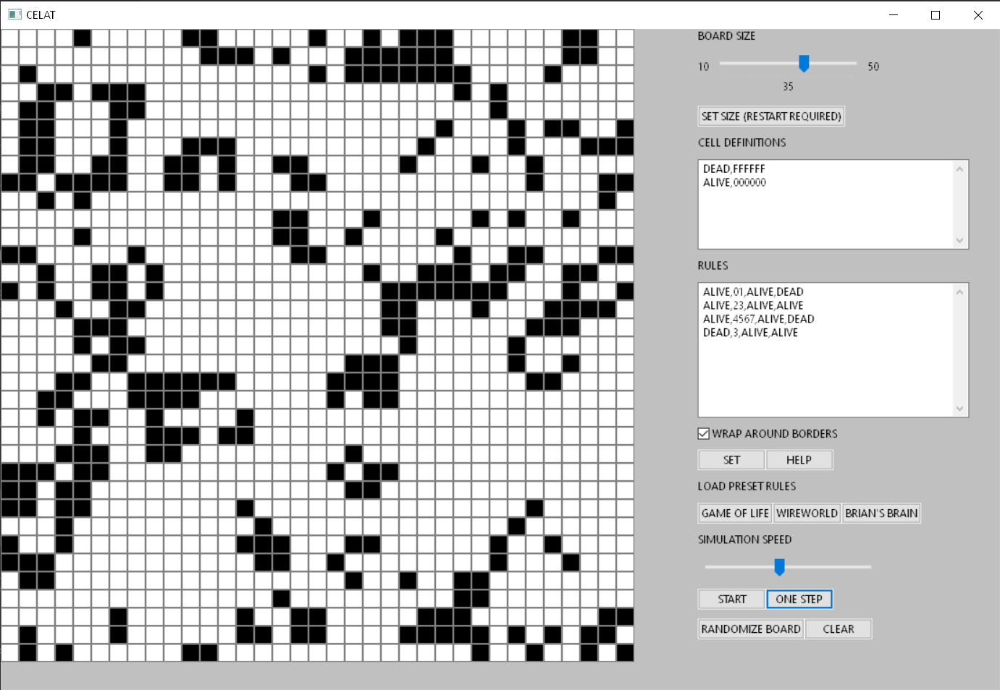

# CELAT - Universal Cellular Automaton

# User guide

## Introduction

Celat is a universal cellular automaton allowing user to define their own rules. It contains easy to use GUI and comes with 3 predefined popular automata Game of Life, Wireworld and Brian's Brain.

## Installation

This application is distributed as a project for Microsoft Visual Studio and can be cloned from public repository located at MFF GitLab. 

It is necessary to unzip libraries as they had to be compressed due to their size.

1. `git clone https://github.com/milan252525/celat.git`

2. `cd celat`

3. Extract `lib/wxWidgets.zip` in its location (Using Windows File Explorer, WinRAR, ...)

4. Make sure the file structure remains the same (`celat/lib/wxWidgets` containing `lib/` and `include/`)

## Building the application

There are two options:

- using Visual Studio

- using msbuild in command line

### Command line build

You can use **Developer Command Prompt for VS 2019** that gets installed with VS.

Type in the following command: `msbuild celat.sln /t:Build /p:Configuration=Release`

In case you use normal Command prompt you will have to locate where msbuild is installed. Typical location is: 

`C:\Program Files (x86)\Microsoft Visual Studio\2019\Community\MSBuild\Current\Bin\MSBuild.exe`

You can additionally specify platform with`/p:Platform=x86` argument. Available options are `x64` (64-bit) and `x86` (32-bit).

Alternatively you can download Windows executables from this [release](https://gitlab.mff.cuni.cz/abraham1/celat/-/releases/v1).

## Usage

A grid of the automaton is located on the left side. You can click each individual cell to cycle its state to a next one. On the right side a control panel is located.

Game of Life automaton is preloaded when opening the application.

### Cell definitions

In the first textbox you can define cells of the automaton.

Each definition needs to be on separate line, empty lines will be ignored.

**Format:** NAME,COLOUR,PROBABILITY

| Name        | Description                                                                          |
| ----------- | ------------------------------------------------------------------------------------ |
| NAME        | name of the cell type, only letter of English alphabet should be used, no whitespace |
| COLOUR      | hexadecimal RGB representation of a cell colour                                      |
| PROBABILITY | probability of this cell appearing when board is randomly generated                  |

**Examples**:

DEAD,FFFFFF

ALIVE,22CC66

### Rules

Rules go into the second textbox.

**Format:** CURRENT_STATE,NEIGHBOUR_AMOUNT,NEIGHBOUR_STATE,NEW_STATE

| Name            | Description                                                  |
| --------------- | ------------------------------------------------------------ |
| CURRENT_STATE   | cell state the rule is applied to                            |
| NEIGHBOUR_STATE | amount of neighbors, can contain multiple digits             |
| NEIGHBOUR_STATE | state of neighbouring cells                                  |
| NEW_STATE       | state the cell will transform into if all conditions are met |

**Notes:** 

Cell of CURRENT_STATE will transform into NEW_STATE if it has NEIGHBOUR_AMOUNT of neighbouring cells with NEIGHBOUR_STATE.

Leave NEIGHBOUR_AMOUNT and NEIGHBOUR_STATE to always transform.

**Examples**:

ALIVE,1,DEAD,DEAD

ALIVE,123,DEAD,DEAD (= 1 or 2 or 3)

ALIVE,,,DEAD (triggers every time)

After you specify cells and rules you can choose if the grid should wrap around (become a torus) or if there should be a border. However choosing border means cells on edges will not all have 8 neighbours.

To load rules into automaton load press SET button.

Change of rules will only take place after pressing SET button and board will always be reset.

### Presets

You can load one of preloaded automatons by pressing "GAME OF LIFE", "WIREWORLD" or "BRIAN'S BRAIN".

**Game Of Life**

Conway's Game of Life is one of the most famous automatons. A cell can be either live or dead. Cells follow these simple rules:

Any live cells dies if it has less than two or more than tree live neighbours.

A live cell with two or three live neighboursstays alive.

Any dead cell with three live neighbours becomes live.

**Wireworld**

Automaton by Brian Silverman suited for simulating transistors. It has four states: empty, electron head, electron tail and conductor.

Empty always stays empty. Electron head becomes tail and tail becomes conductor.

Conductor becomes electron head if it has one or two heads as neighbours.

**Brian's Brain**

Another automaton by Brian Silverman. Cells can have three states: alive, dead and dying. 

Alive cell always becomes dying, dying always becomes dead. 

Dead cell becomes alive if it has  two alive neighbours.

This automaton almost always results in chaotic growth, randomizing the board is recommended with this one.

### Other functionalities

**SET BOARD SIZE** - set size of the board, application will restart and all settings will be reset!

**ONE STEP** - advances the automaton by one evolution

**RANDOMIZE BOARD** - every cell is set to random state

**CLEAR** - clears the board to default state (default state is the frist defined state)

**START** - automatically starts advancing the automaton, speed can be adjusted with a slider 
